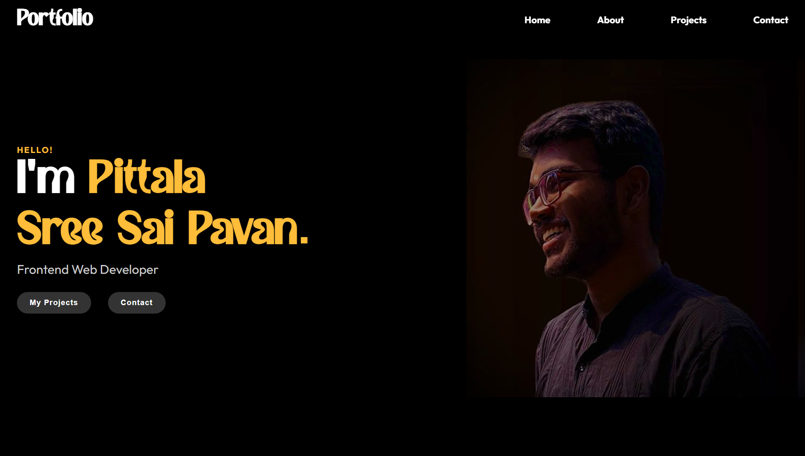

<div align="center">

# 🚀 Pittala Sree Sai Pavan | Portfolio

### *Frontend Web Developer*

[](https://p-sree-sai-pavan.github.io/Portfolio/)
[](https://www.linkedin.com/in/sree-sai-pavan-pittala-61a284365)
[](https://github.com/p-sree-sai-pavan)

<br>



</div>

---

## ✨ About

A sleek, modern, and fully responsive portfolio website showcasing my skills, projects, and experience as a **Frontend Web Developer**. Currently pursuing B.Tech in Electronics and Communication Engineering at **IIT Guwahati**.

---

## 🛠️ Tech Stack

<div align="center">

| Frontend | Languages | Tools |
|:--------:|:---------:|:-----:|
|  |  |  |
|  |  |  |
|  |  |  |

</div>

---

## 🎯 Features

- ⚡ **Modern & Minimal Design** — Clean UI with smooth animations
- 📱 **Fully Responsive** — Works on all devices
- 🎨 **Custom Font** — Bacley font for unique branding
- 🌙 **Dark Theme** — Easy on the eyes
- 🔗 **Smooth Navigation** — Seamless scrolling experience
- 💼 **Project Showcase** — Highlighting featured work

---

## 📂 Project Structure

```
portfolio/
├── index.html          # Main HTML file
├── style.css           # Stylesheet
├── Bacley DEMO.otf     # Custom font
└── README.md           # You are here!
```

---

## 🚀 Featured Projects

| Project | Description | Tech |
|---------|-------------|------|
| **Circuit Analyser** | A web-based circuit analysis tool | HTML, CSS, JS, React, Python |
| **Algo Visualiser** | Algorithm visualization platform | HTML, CSS, JS, React |
| **Portfolio** | Personal portfolio website | HTML, CSS, JS |

---

## 📊 Stats

<div align="center">

| 🏆 Codeforces Rating | 🎓 Education | 💼 Role |
|:--------------------:|:------------:|:-------:|
| **1130** | IIT Guwahati | Jr. Web Developer |

</div>

---

## 🏃‍♂️ Quick Start

1. **Clone the repository**
   ```bash
   git clone https://github.com/p-sree-sai-pavan/portfolio.git
   ```

2. **Navigate to the folder**
   ```bash
   cd portfolio
   ```

3. **Open in browser**
   ```bash
   # Simply open index.html in your browser
   # Or use Live Server in VS Code
   ```

---

## 📬 Contact

<div align="center">

[](mailto:pavan90507@gmail.com)

[](https://www.linkedin.com/in/sree-sai-pavan-pittala-61a284365)

</div>

---

<div align="center">

### ⭐ If you like this portfolio, give it a star!

Made with ❤️ by **Pittala Sree Sai Pavan**

</div>
